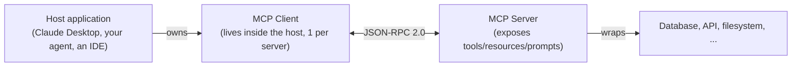

# 20 — MCP Fundamentals

## Theory

In [module 19](../19_agents), the tools a model could use were plain Python functions living right there in the same file. **MCP (Model Context Protocol)** solves a different problem: what if you want the *same* tools to be usable by several different apps, without copy-pasting the code into each one? MCP is a standard, shared way for an AI app to talk to a separate program that offers up tools, data, or ready-made prompts — so you build the tool once, as its own small server, and any MCP-compatible app can use it.

**The three players involved:**

- **Host** — the app the person is actually using (Claude Desktop, your own agent, a code editor's AI assistant).
- **Client** — a small piece living inside the host that's in charge of talking to one specific server.
- **Server** — a separate, small program that offers up some capability (a tool, some data, a prompt). It doesn't know or care which AI model is using it.

**Two ways the client and server can talk to each other:**
- **stdio** — the simplest option: the host starts the server as a small program on the same machine and talks to it directly, no networking involved. Good for local tools ([modules 21](../21_mcp_create_server), [22](../22_mcp_stdio_client)).
- **Streamable HTTP** — the server runs on its own, possibly on a different machine entirely, and the client connects to it over the internet/network, the same way a web browser connects to a website ([module 23](../23_mcp_http_client)). Needed when many people/apps need to share one server.

**Three kinds of things a server can offer:**
- **Tools** — actions the model can choose to take, just like module 19's tools, except now they live in a separate server instead of your own code.
- **Resources** — read-only pieces of data the app can fetch and show the model as background information (a file, a database entry) — these aren't "actions," just information to look at.
- **Prompts** — ready-made, fill-in-the-blank prompts that the server provides, so good prompt-writing for a particular kind of data lives in one place instead of being copied into every app that uses it. Covered in [module 24](../24_mcp_hosting_resources_prompts).

## Use Case

MCP matters once you want to reuse the same tool/data integration across multiple LLM apps/agents without rewriting glue code for each: one MCP server for "our internal ticketing system" can be plugged into Claude Desktop, a custom LangGraph agent, and a CI bot, unchanged.

## How to Run

Nothing to run here — this module is conceptual (architecture/transports/primitives), with no `example.py`. The exercises are worked through on paper/in discussion; see [`solutions.md`](solutions.md).

## Reference Docs

- MCP specification: https://modelcontextprotocol.io/
- MCP architecture overview: https://modelcontextprotocol.io/docs/concepts/architecture
- Python SDK: https://github.com/modelcontextprotocol/python-sdk

## Exercises

These are pen-and-paper exercises — no code, since this module is purely conceptual. The goal is to make sure the architecture/transport/primitives vocabulary from Theory actually sticks before you build a real server in module 21.

1. **Applying the architecture diagram to something real.** Pick a real (or plausible) scenario from your own work or a hobby project — something you'd want an AI assistant to be able to look up or act on. Sketch it using this module's Host/Client/Server diagram: what would the *server* wrap (a database? an API? a filesystem?), and which transport (stdio or HTTP) makes sense for it?
2. **What a tool definition actually needs, beyond a Python function.** Read the MCP specification's section on tool definitions (linked below). A Python function has a name and a signature; identify at least 2 things a proper MCP tool definition requires that a bare Python function doesn't automatically provide.
3. **MCP vs. "just build a REST API."** For the scenario you sketched in exercise 1, imagine building it as a plain REST API instead of an MCP server. Write down 2-3 things MCP gives you "for free" (discovery, standardized categorization of tools/resources/prompts, etc.) that you'd otherwise have to design and document yourself in a REST API.
4. **Choosing a transport, and being able to justify it.** For the same scenario, decide: stdio or HTTP? Write one or two sentences explaining why, based on this module's Theory section (who's going to be launching/connecting to this server, and from how many places at once).

**Solutions:** see [`solutions.md`](solutions.md) in this folder (these exercises are conceptual, so there's no `solutions.py`).
