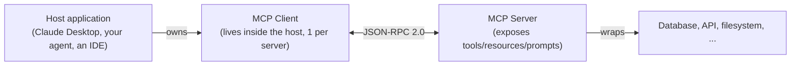

# 20 — MCP Fundamentals

## Theory

The **Model Context Protocol (MCP)** is an open standard (originally from Anthropic) for connecting LLM applications to external tools, data, and prompts through a single, consistent protocol — instead of every app writing bespoke integration code for every tool/data source it needs.

**Architecture:**

- **Host** — the LLM-facing application (Claude Desktop, your own agent, an IDE assistant).
- **Client** — lives inside the host, holds a 1:1 connection to one server, speaks the protocol on the host's behalf.
- **Server** — a lightweight process that exposes capabilities. A server doesn't know or care which LLM is on the other end.

**Transports** (how client and server actually exchange bytes):
- **stdio** — the host launches the server as a local subprocess and talks over stdin/stdout. Simplest option, zero network config, used for local tools ([modules 21](../21_mcp_create_server), [22](../22_mcp_stdio_client)).
- **Streamable HTTP** — the server runs independently (possibly remote) and the client connects over HTTP, with responses streamed back ([module 23](../23_mcp_http_client)). Needed when the server isn't a local subprocess (shared team server, hosted service).

**Primitives** (what a server can expose):
- **Tools** — functions the model can call, with typed arguments (the MCP equivalent of the `@tool`-decorated functions from [module 19](../19_agents), but served over the wire instead of defined in-process).
- **Resources** — read-only data the host can fetch and inject as context (a file, a database row, an API response) — think of these as addressable, fetchable context rather than actions.
- **Prompts** — reusable, parameterized prompt templates the server exposes, so prompt engineering for a given data source lives with that data source instead of being copy-pasted into every client. Covered in [module 24](../24_mcp_hosting_resources_prompts).

## Use Case

MCP matters once you want to reuse the same tool/data integration across multiple LLM apps/agents without rewriting glue code for each: one MCP server for "our internal ticketing system" can be plugged into Claude Desktop, a custom LangGraph agent, and a CI bot, unchanged.

## How to Run

Nothing to run here — this module is conceptual (architecture/transports/primitives), with no `example.py`. The exercises are worked through on paper/in discussion; see [`solutions.md`](solutions.md).

## Reference Docs

- MCP specification: https://modelcontextprotocol.io/
- MCP architecture overview: https://modelcontextprotocol.io/docs/concepts/architecture
- Python SDK: https://github.com/modelcontextprotocol/python-sdk

## Exercises

1. Sketch (on paper or in a diagram tool) an MCP setup for a scenario from your own work — what would the server wrap, and which transport would you use?
2. Read the MCP spec's tool schema definition and identify what a tool definition requires beyond a name and a Python function signature.
3. Compare the primitives (tools/resources/prompts) to what a plain REST API would look like for the same use case — what does MCP standardize that you'd otherwise have to design yourself?
4. Decide, for a server you might build, whether stdio or HTTP is the right transport, and write down why.

**Solutions:** see [`solutions.md`](solutions.md) in this folder (these exercises are conceptual, so there's no `solutions.py`).
